# Análise de sentimento de feedbacks - App Saude Mental AluMind

## Case

Desafio AluMind, uma startup que oferece um aplicativo focado em bem-estar e saúde mental, proporcionando aos usuários acesso a meditações guiadas, sessões de terapia, e conteúdos educativos sobre saúde mental. A tarefa é criar uma aplicação cuja responsabilidade seja de analisar os feedbacks vindos dos usuários, classificá-los a partir do seu sentimento e elencar as possíveis melhorias contidas neles.

## Requisitos

- Analisar sentimento do feedback
- Extrair possível intenção do usuário (menção de possível funcionalidade)
- Classificar intenção
- Detectar ofensas em feedbacks improdutivos
- Gerar resposta do assistente para o feedback do usuário com base na intenção

## Como rodar a aplicação

### Pré requisitos:

- Docker e Docker compose
- Ollama (opcional)

Para configurar os recursos necessários, você precisa ter o Docker instalado em sua máquina e executar, com o Docker Compose, o arquivo `docker-compose.yml` com o comando `docker compose up -d` para inicializar os containers.

Isso configurará:

- Uma instância do Ollama, com o modelo [gemma2](https://ollama.com/library/gemma2:9b). Sua interface web está disponível em [http://localhost:8081/](http://localhost:8081/).
- Uma instância do Qdrant. Sua interface web está disponível em [http://localhost:6333/dashboard](http://localhost:6333/dashboard).
- Uma instância de MySQL e outra do PhpMyAdmin que estará disponível em [http://localhost:6333/dashboard](http://localhost:8989/)

> Aviso - Este repo está rodando um LLM localmente com a cli Ollama, portanto, no arquivo docker-compose, os comando para criar os containers que rodam o ollama e o modelo estão comentados. Caso for usar, apenas descomente as linhas comentadas e rode o comando `docker compose up -d`

## Configuração para usar o LangChain4J

O projeto está usando o framework LangChain4J para gerenciar modelos fundamentais, Ollama foi escolhido por ter possibilidade de rodar local. Ele pode ser executado localmente (com Docker, usando Ollama + Gemma2 e Qdrant) ou com a CLI do Ollama para Mac com GPU.

**Melhorando o desempenho**: se você tiver GPUs em sua máquina, o desempenho do Ollama pode ser muito melhorado ao usá-las. A maneira mais fácil é instalar o Ollama localmente na sua máquina e instalar os modelos.

### Executando localmente com Docker

Esta configuração usa Ollama e Qdrant, rodando em contêineres Docker.

> Aviso - A geração de imagens, como no Dall-E 3, não está disponível nesta configuração.

A execução local é habilitada usando o perfil `local` do Spring Boot.
Uma maneira de fazer isso é definir `spring.profiles.active=local` no arquivo `src/main/resources/application.properties`.

## Mudar de modelo

Se estiver estiver rodando o Ollama **localmente**, execute o comando `ollama run <modelo desejado>` para rodar outro modelo desejado para testar os prompts.

Se estiver rodando **pelo Docker**, mude no arquivo shell `install-ollama-models.sh` o nome do modelo no comando `ollama pull`. Pode adicionar mais modelos nas linhas posteriores

> Aviso - recomenda-se um de 4b de parâmetros ou mais

No package de `configs`, mude a configuração, no OllamaChatModel builder mude o nome do modelo no método `modelName("")`

[**Veja as opções no site do Ollama**](https://ollama.com/library/gemma2:9b)

## Configuração do Database com MySQL e JPA

Nas propriedades da aplicação está setado algumas informações do banco, que podem ser alteradas

`spring.datasource.url=jdbc:mysql://localhost:3306/spring_boot_with_llm`

`spring.datasource.username=root`

`spring.datasource.password=secretpass`

Se não for rodar localmente pelo docker, mude essas configurações acima.

### SCHEMA

**Insight** - define os insights identificados pelo LLM, contém o comentário ao qual é baseado
**Feedback** - define o texto do feedback e um usuário
**Intent** - define funcionalidade do aplicativo que poderia ser implementada ou melhorada

`Insight -> Feedback` - um pra um, direção unidirecional

`Insight -> Intent` - um pra muitos, direção unidirecional

> 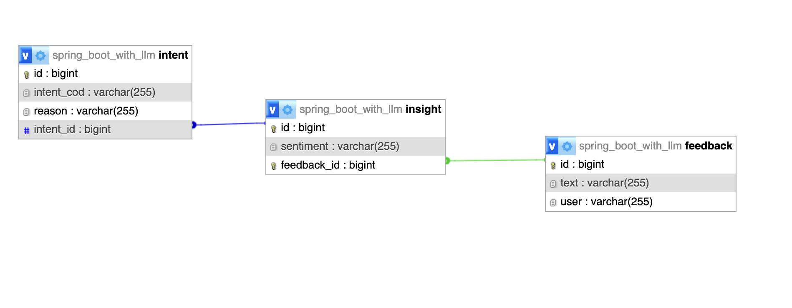

## Aplicação

### Executar

Com o comando maven rode `mvn spring-boot:run` ou `mvnw spring-boot:run` se não tiver o maven instalado.


### Detectar comentário ofensivo

`http://localhost:8000/prompt2`

### Extrair insights

> Foi criado uma outra rota para diminuir latência, para não demorar muito para uma resposta ser gerada, dividir instruções e montar cadeias de prompts pode ser mais eficiente, e também organizar melhor o output, já que com a resposta do assistente não tem muito o que se fazer além de exibir para o usuário.

`http://localhost:8000/prompt1`

Fornato da Requisição:

```
GET /prompt1
Content-Type: application/json
{
  "feedback": "Gosto muito de usar o Alumind! Está me ajudando bastante em relação a alguns problemas que tenho. Só queria que houvesse uma forma mais fácil de eu mesmo realizar a edição do meu perfil dentro da minha conta"
}
```

Formato da Resposta:

```
{
    "id": 10,
    "sentiment": "positivo",
    "feedback": {
        "id": 11,
        "user": null,
        "text": "Finalmente um app que realmente me ajuda a lidar com a ansiedade! Os exercícios diários são incríveis e os recursos de acompanhamento do meu humor são muito úteis."
    },
    "intent": [
        {
            "id": 11,
            "intentCod": "funcionalidade_aplicaçao",
            "reason": "Os exercícios diários são incríveis e os recursos de acompanhamento do meu humor são muito úteis."
        }
    ]
}
```

### Resposta do assistente

`http://localhost:8000/assistantResponseFor/{insight_id}`

### CRUD de entidades

POST `http://localhost:8000/entidade/create`

PUT `http://localhost:8000/entidade/update`

GET `http://localhost:8000/entidade/list`

GET `http://localhost:8000/entidade/find/{id}`

DELETE `http://localhost:8000/entidade/delete/{id}`

## Prompts para o LLM

**Usado gemma2:9b como LLM porque**

- número maior de parâmetros (9b)
- feito para fluxos conversacionais, chatbot, geração de texto e sumarização
- modelo educativo que pode ser usado para geração de código, como JSON
- boa base de português brasileiro

**Prompt 1 Extração e análise de sentimento**

Você está analisando um comentário de um usuário sobre um aplicativo de saúde mental \ \n Extraia do texto informações como sentimento NEGATIVO ou POSITIVO, uma menção de alguma funcionalidade do aplicativo e complete o formato Insight. \ \n A propriedade id sempre terá valor null. \ \n responda com português brasileiro. \ \n A propriedade intentCod é um códico em uppercase que define que tipo de funcionalidade do aplicativo que é mencionada e a propriedade reason o pedaço do texto que justifique esta intendCod. \ \n você pode colocar o nome que quiser na propriedade user do feedback. \n \n
texto: \n
{{it}}

**Prompt 2 Generativo - resposta do assistente para o feedback**

Você atuará como um assistent virtual. Com base na classe recebida, analise os valores dos parametros e escreva uma breve resposta para o feedback do usuário. \n seja educado, simples e evite palavras ofensivas.
classe:
{{it}}

**Prompt 3 Classificação de comentário ofensivo ou inofensivo**

Analise se o comentário sobre um aplicativo de saúde mental é inofensivo ou ofensivo \n
texto: \n
{{it}}

### Nice to Have

**RAG** Resposta do Assistent baseado em uma documentação base com tutoriais e regras de negócio, com sistema de embeeding para buscar nesta base de documento o que responder.

**Dashboard analítico** Integração com dashboard analítico para futuras análises, como por exemplo, intents mais pedidas, funcionalidades mais comentadas, trilhas com menor engajamento, etc.

### Comentários para teste - feitos no Postman

1.  **"Finalmente um app que realmente me ajuda a lidar com a ansiedade! Os exercícios diários são incríveis e os recursos de acompanhamento do meu humor são muito úteis."** (Positivo, Recursos de acompanhamento do meu humor)
2.  **"Gostei da variedade de meditações guiadas, mas acho que poderiam adicionar mais opções para diferentes necessidades, como insônia ou stress pós-trabalho."** (Sugestão Positiva)
3.  **"A interface é simples e fácil de usar, o que torna a experiência muito agradável. Recomendo para quem busca um app acessível e eficiente."** (Positivo)
4.  **"Fiquei decepcionado com a falta de opções personalizáveis. O app parece seguir um roteiro fixo e não adapta às minhas necessidades específicas."** (Negativo)
5.  **"Achei o conteúdo um pouco superficial. Preciso de algo mais profundo para lidar com os meus problemas psicológicos complexos."** (Negativo)
6.  **"O app é ótimo para iniciantes, mas quem já tem experiência com mindfulness pode achar as atividades repetitivas."** (Sugestão Negativa)

### Resultados

1

```
HARMLESS
```

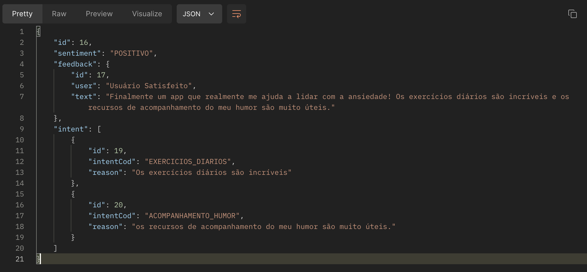

```
{
    "id": 16,
    "sentiment": "POSITIVO",
    "feedback": {
        "id": 17,
        "user": "Usuário Satisfeito",
        "text": "Finalmente um app que realmente me ajuda a lidar com a ansiedade! Os exercícios diários são incríveis e os recursos de acompanhamento do meu humor são muito úteis."
    },
    "intent": [
        {
            "id": 19,
            "intentCod": "EXERCICIOS_DIARIOS",
            "reason": "Os exercícios diários são incríveis"
        },
        {
            "id": 20,
            "intentCod": "ACOMPANHAMENTO_HUMOR",
            "reason": "os recursos de acompanhamento do meu humor são muito úteis."
        }
    ]
}
```

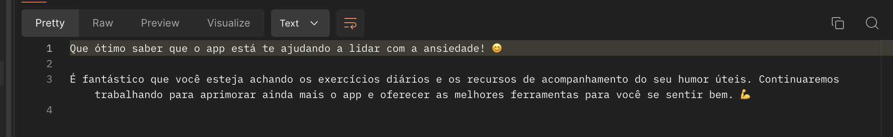

```
Que ótimo saber que o app está te ajudando a lidar com a ansiedade! 😊

É fantástico que você esteja achando os exercícios diários e os recursos de acompanhamento do seu humor úteis. Continuaremos trabalhando para aprimorar ainda mais o app e oferecer as melhores ferramentas para você se sentir bem. 💪
```

2

```
HARMLESS
```

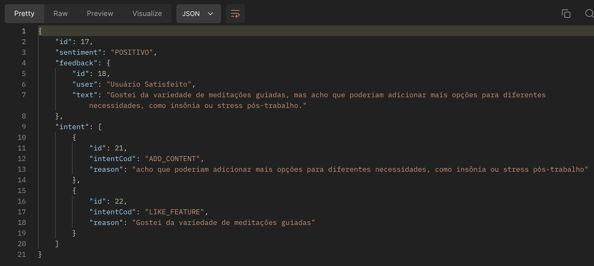

```
{
    "id": 17,
    "sentiment": "POSITIVO",
    "feedback": {
        "id": 18,
        "user": "Usuário Satisfeito",
        "text": "Gostei da variedade de meditações guiadas, mas acho que poderiam adicionar mais opções para diferentes necessidades, como insônia ou stress pós-trabalho."
    },
    "intent": [
        {
            "id": 21,
            "intentCod": "ADD_CONTENT",
            "reason": "acho que poderiam adicionar mais opções para diferentes necessidades, como insônia ou stress pós-trabalho"
        },
        {
            "id": 22,
            "intentCod": "LIKE_FEATURE",
            "reason": "Gostei da variedade de meditações guiadas"
        }
    ]
}
```

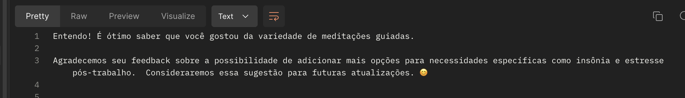

```
É ótimo saber que você gostou da variedade de meditações guiadas!  😊

Agradecemos seu feedback sobre a possibilidade de adicionar mais opções para necessidades específicas como insônia e stress pós-trabalho. Vamos levar isso em consideração!
```

3.  A interface é simples e fácil de usar, o que torna a experiência muito agradável. Recomendo para quem busca um app acessível e eficiente.

```
HARMLESS
```

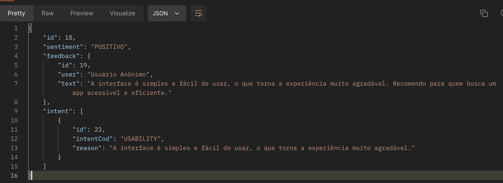

```
{
    "id": 18,
    "sentiment": "POSITIVO",
    "feedback": {
        "id": 19,
        "user": "Usuário Anônimo",
        "text": "A interface é simples e fácil de usar, o que torna a experiência muito agradável. Recomendo para quem busca um app acessível e eficiente."
    },
    "intent": [
        {
            "id": 23,
            "intentCod": "USABILITY",
            "reason": "A interface é simples e fácil de usar, o que torna a experiência muito agradável."
        }
    ]
}
```

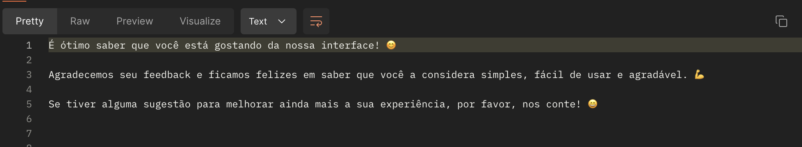

```
É ótimo saber que você está gostando da nossa interface! 😊

Agradecemos seu feedback e ficamos felizes em saber que você a considera simples, fácil de usar e agradável. 💪

Se tiver alguma sugestão para melhorar ainda mais a sua experiência, por favor, nos conte! 😄
```

4.

```
HARMLESS
```

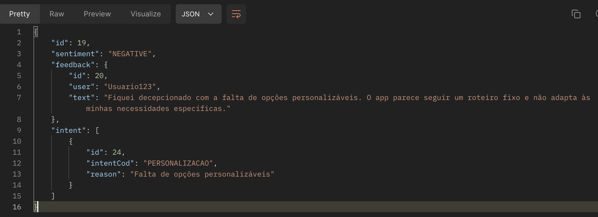

```
{
    "id": 19,
    "sentiment": "NEGATIVE",
    "feedback": {
        "id": 20,
        "user": "Usuario123",
        "text": "Fiquei decepcionado com a falta de opções personalizáveis. O app parece seguir um roteiro fixo e não adapta às minhas necessidades específicas."
    },
    "intent": [
        {
            "id": 24,
            "intentCod": "PERSONALIZACAO",
            "reason": "Falta de opções personalizáveis"
        }
    ]
}
```

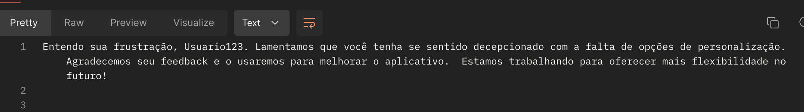

```
Entendo sua frustração, Usuario123. Lamentamos que você tenha se sentido decepcionado com a falta de opções de personalização. Agradecemos seu feedback e o usaremos para melhorar o aplicativo.  Estamos trabalhando para oferecer mais flexibilidade no futuro!
```

5.

```
HARMLESS
```

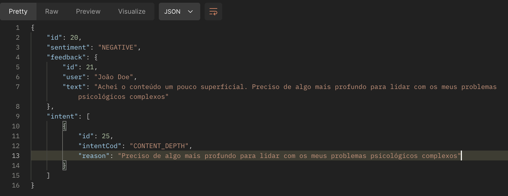

```
{
    "id": 20,
    "sentiment": "NEGATIVE",
    "feedback": {
        "id": 21,
        "user": "João Doe",
        "text": "Achei o conteúdo um pouco superficial. Preciso de algo mais profundo para lidar com os meus problemas psicológicos complexos"
    },
    "intent": [
        {
            "id": 25,
            "intentCod": "CONTENT_DEPTH",
            "reason": "Preciso de algo mais profundo para lidar com os meus problemas psicológicos complexos"
        }
    ]
}
```


```
Olá João Doe!

Entendo que você achou o conteúdo um pouco superficial e precisa de algo mais aprofundado para lidar com seus problemas psicológicos.

Vamos ver como posso te ajudar a encontrar recursos mais completos e adequados às suas necessidades.  Você poderia me dizer um pouco mais sobre os tipos de problemas que você enfrenta?
```

6.

```
HARMLESS
```


```
{
    "id": 14,
    "sentiment": "NEUTRO",
    "feedback": {
        "id": 15,
        "user": "Usuário Teste",
        "text": "O app é ótimo para iniciantes, mas quem já tem experiência com mindfulness pode achar as atividades repetitivas."
    },
    "intent": [
        {
            "id": 17,
            "intentCod": "ATIVIDADES_REPETITIVAS",
            "reason": "quem já tem experiência com mindfulness pode achar as atividades repetitivas"
        }
    ]
}

```

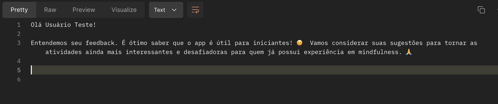

```
Olá Usuário Teste!

Entendemos seu feedback. É ótimo saber que o app é útil para iniciantes! 😊  Vamos considerar suas sugestões para tornar as atividades ainda mais interessantes e desafiadoras para quem já possui experiência em mindfulness. 🙏

```

## Tags semânticas usadas

- [ ] `feat` Nova funcionalidade
- [ ] `fix` Correção de um bug
- [ ] `docs` Atualização de documentação
- [ ] `refactor` Alteração no código que não é funcionalidade nova nem correção de bug
- [ ] `perf` Melhoria de performance
- [ ] `test` Adição, alteração ou remoção de testes
- [ ] `build` Alteração no processo de build ou em dependencias externas
- [ ] `ci` Alteração de pipeline ou fluxo de publicação
- [ ] `chore` Outras alterações que não modificam arquivos base ou arquivos de teste
- [ ] `revert` Reversão de commits anteriores

**Exemplo**: `fix/deleteaccount route: concerto de bug no botão delete`
